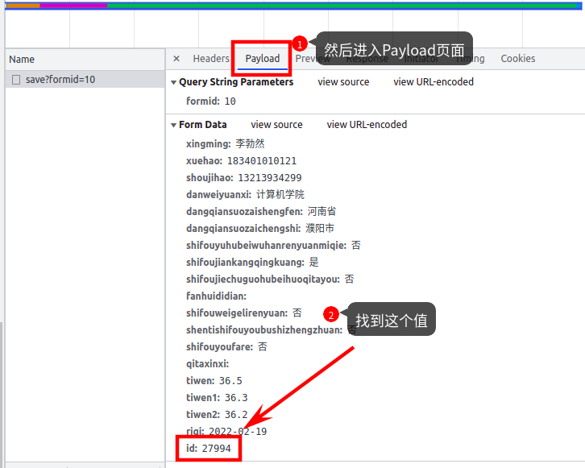
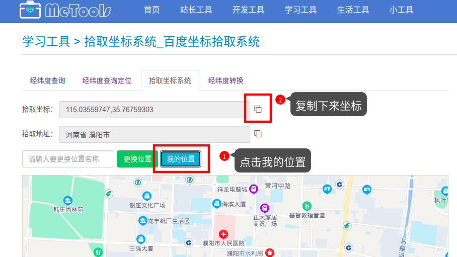

# 疫情自动打卡系统使用说明

## 1. 登录

本系统的初始用户名为：姓名首字母缩写（例如：lbr）

密码为：姓名首字母缩写 + 123456（lbr123456）

如果无法登录进系统，让12218在系统导入你的信息

## 2. 进入自动打卡系统

进入系统之后，先进入information页面填写信息

## 3. 抓包

**第一步：**浏览器新建一个窗口进入疫情打卡系统：https://app.sau.edu.cn/form/wap/default?formid=10

**第二步：**进入浏览器的开发者工具

**第三步：**抓取请求

先在开发者工具中选中“Network”选项

之后点击“提交信息”按钮

**第四步：**获取必要信息

鼠标选中开发者工具中抓取到的请求，之后从cookies中找必要消息

**第五步：**将上述值填写到information页面，**请确保填写的值的正确性**

## 4. 创建打卡任务

**第一步：**进入My tasks页面，点击右下角的“+”创建一个打卡任务

**第二步：**在弹出框中填写对应信息即可，填写完成后点击提交按钮

坐标可以从这个网站获取：http://www.metools.info/learn/getpoint202.html

